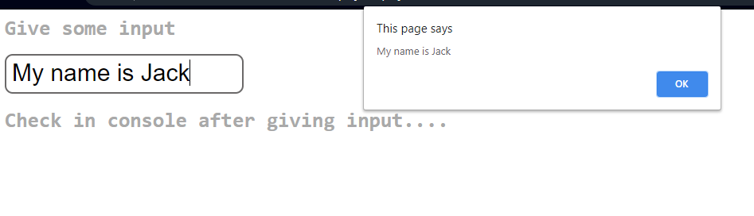

### Check out live demo: [here](https://titli9830.github.io/Debounce-Concept/) 

OR

### Download & run the code in your machine.

## Project Screenshots

### Notes:

This project is a simple example of Debounce concept using Java Script.It is made using Java Script,HTML,CSS. This project will show how to implement Debounce in your code using setTimeout() & wait to execute your function after certain time-period.Here in the input box after giving input, it will take certain time gap to finally publish the input through an alert.
