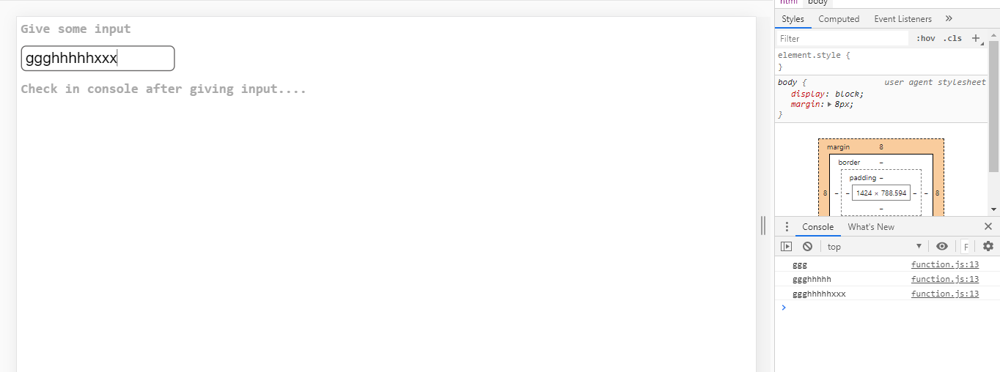

## Project Screenshots

### Notes:

This project is a simple example of Debounce concept using Java Script.It is made using Java Script,HTML,CSS. This project will show how to implement Debounce in your code using setTimeout() & wait to execute your function after certain time-period.For this project you should open console tab on the browser to see the result.

### Output

Check here: [https://titli9830.github.io/Debounce-Concept/](https://titli9830.github.io/Debounce-Concept/) 

OR

Download & save the code in your machine. Open the html file in any browser to see the result

### Source Code Link

Check Here: [https://github.com/titli9830/Debounce-Concept](https://github.com/titli9830/Debounce-Concept)
